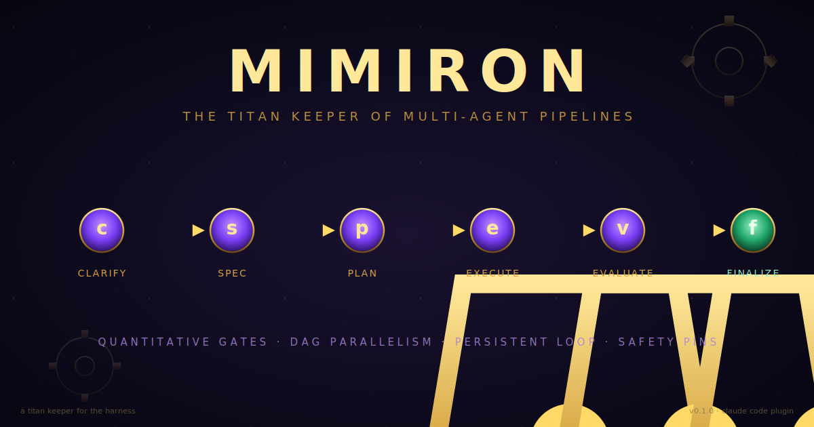

<div align="center">



<br/>

[](#테스트)
[](https://www.python.org)
[](./LICENSE)
[](./CHANGELOG.md)
[](https://claude.com/claude-code)

**Claude Code용 멀티 에이전트 하네스. 정량 게이트, DAG 기반 병렬 실행, persistent loop — 14개의 안전핀이 지킨다.**

[빠른 시작](#빠른-시작) · [개념](#개념) · [아키텍처](#아키텍처) · [문서](#문서) · [English](./README.md)

</div>

---

## 왜 Mimiron인가

대부분의 "AI 코딩 에이전트"는 *LLM 하나를 루프로 돌리는* 형태다. 작은 수정엔 충분하지만, *스펙 규율*이나 *병렬 작업* 또는 *드리프트 없는 retry*가 필요해지면 깨진다.

Mimiron은 *에이전트가 아니라* **하네스**다. LLM 출력은 *의심 대상*으로 취급하고, 파일 시스템을 ground truth로 본다. 모든 phase 전이는 **결정적 게이트**가 결정하고, 모든 워커 산출은 **해시 검증**되며, 모든 루프엔 *돌고 있는 에이전트를 멈추는* **안전핀**이 있다.

이름은 [울두아르의 티탄 키퍼](https://wowpedia.fandom.com/wiki/Mimiron) — 기계 수호자를 만드는 발명가-장인, *속도보다 측정된 구성*에 집착한 자에게서 따왔다.

## 빠른 시작

Claude Code 세션에서:

```
/plugin marketplace add skarl86/mimiron
/plugin install mimiron@skarl86-mimiron
```

설치는 이걸로 끝. `/mimiron`, `/mimiron-status`, `/mimiron-resume`, `/mimiron-pause`, `/mimiron-unstuck` 슬래시 명령과 함께 8 skills + 3 worker agents + 3 hooks(SessionStart / Stop / PostToolUse drift) 모두 활성화된다.

이제 작업할 프로젝트에서 feature를 시작:

```
/mimiron "Flask 앱에 /version 엔드포인트 추가"
```

6 phase 파이프라인이 발동: Socratic 명료화 → spec 결정화 → DAG 작성 → 병렬 워커 dispatch → 결정적 게이트 평가 → 커밋 제안. `state.json`이 ledger — hook(과 사용자)이 어느 phase에서든 interrupt 가능.

### 선택: 결정적 CLI

위 skill들은 결정적 lane(Python CLI: `mimiron`, `mimiron-bench`)을 호출한다. 직접 명령을 쓰거나(혹은 hook이 `$PATH`에서 찾으려면) 한 번 설치:

```bash
git clone https://github.com/skarl86/mimiron /tmp/mimiron && cd /tmp/mimiron
uv pip install -e .         # 또는: pip install -e .
```

그 다음 새 프로젝트의 mechanical toolchain을 한 줄로 부트스트랩:

```bash
mimiron init my-feature --bootstrap-toolchain=python-uv   # 또는 python-pip | node-npm | go
```

`.mimiron/_global/{mechanical.toml,thresholds.yaml}`이 `evals/` 템플릿에서 자동 작성돼 `gate mechanical`이 바로 작동.

## 6 phase 파이프라인

```
clarify ──τ──▶ spec ──q──▶ plan ──c──▶ execute ──a──▶ evaluate ──v──▶ finalize ─▶ done
   ▲             ▲           ▲            ▲│              ▲│
   │             │           │      retry │└── fail ──────┘│
   │             │           │       ≤3   │                │
   │             │           │            ▼                │
   └─────────────┴───────────┴─────── stuck ◀──── fail × 3 ┘
                                         │
                                         ▼
                                      paused (via unstuck)
```

각 화살표는 **게이트** — 결정적, LLM 호출 없이 phase 전이를 결정:

| 게이트 | Phase 종료 | 무엇을 검사 |
|---|---|---|
| **τ ambiguity** | clarify → spec | `ambiguity_score ≤ 0.20` (median-of-3, certainty band ±0.05) |
| **q quality** | spec → plan | `quality_score ≥ 0.85` (reviewer 비율 페널티 포함) |
| **c plan integrity** | plan → execute | DAG cycle-free + owned_files 충돌 없음 + spec_hash 동결 |
| **a artifacts** | execute → evaluate | 모든 task 커밋됨, hash가 워커 선언과 일치 |
| **v evaluate** | evaluate → finalize | Mechanical (build/test/lint) + Semantic (reviewer median-of-3) |

`fail × 3` → `stuck` → `unstuck` skill 발동. 사용자가 결정하고, 에이전트는 *자동 복구하지 않는다*.

## 개념

### 3-Lane 분리

모든 코드 경로는 정확히 한 lane에 속한다. Cross-lane 호출은 *구조적으로* 차단된다.

```
Creative lane  →  skills (markdown) + agents (Task tool)
                  LLM 판단, state 직접 mutation 금지.

Deterministic  →  CLI (mimiron, mimiron-bench)
                  LLM 호출 0번. 순수 file IO + Python.

Persistence    →  hooks (SessionStart, Stop, PostToolUse)
                  가벼운 접착제. 재진입 + drift 로그만.
```

### 14핀 안전 아키텍처

| 핀 | 위치 | 왜 |
|---|---|---|
| **6겹 무한 루프 방어** | spec § 5.4 | gate 차단 → retry ≤ 3 → consec_fail ≥ 3 → unstuck → wall_clock 4h → token budget 500K |
| **4겹 judge 방어** | spec § 6.4 | median-of-3 + temperature=0, certainty band, acceptance contract 페널티, mutation opt-in |
| **5겹 outer-loop 핀** | spec § 7.5.5 | bench suite 정지: iteration_cap, asymptote, all_deferred, wall_clock, user_abort |

총: 6 + 4 + 5 + spec_hash freeze (1) + 3-Lane 구조 (1) = **14 핀** + 안전 메커니즘이 인격화된 `unstuck`.

### Spec freeze contract

Plan 진입 시점의 spec hash가 `state.json`에 박힌다. 이후 모든 CLI 호출 (`scan`, `commit-task`, `gate semantic`, `archive`)이 매번 `spec.yaml`을 *재해싱* 하고 drift를 **reject**. 풀려면 `unstuck` flow를 통해 `state.spec_unlocked=true` 박는 *유일한* 경로.

### Self-host

Mimiron은 *자기 자신을* `mimiron-bench`로 평가한다. 벤치마크 suite는 실제 머지된 PR을 재현 가능한 fixture로 큐레이션 (현재 3개: B01–B03, 운영 `naver-smartstore` 트래픽). suite aggregate가 `v0 → v1` 졸업을 결정한다.

## 아키텍처

```
mimiron/
├── .claude-plugin/{plugin.json, marketplace.json}
├── commands/                  # /mimiron 진입 + 4 helpers
├── skills/                    # 8 creative-lane SKILL.md
│   ├── clarify/  spec/  plan/  execute/  evaluate/  finalize/
│   ├── unstuck/               # 인격화된 안전핀
│   └── bench-judge/           # self-eval 판정
├── agents/                    # 3 워커 tier (worker/tester/reviewer)
├── hooks/                     # 3 Python hooks + config
├── scripts/                   # mimiron + mimiron-bench bash entries
├── src/mimiron/               # deterministic Python (19 modules)
│   ├── cli.py                 # 9 subcommands
│   ├── state.py spec.py plan.py verdict.py artifacts.py
│   ├── scanner.py gates.py thresholds.py hash_util.py llm.py
│   └── bench/                 # self-eval CLI (run/list/compare/suite/judge)
├── benchmarks/                # B01, B02, B03 fixtures (실 머지 PR)
├── evals/                     # 4 mechanical.toml 템플릿
├── dogfood/                   # 3 archived runs (결함 보고서 포함)
└── tests/                     # 197 passing
```

## 문서

| 문서 | 내용 |
|---|---|
| [`docs/superpowers/specs/2026-05-22-mimiron-design.md`](./docs/superpowers/specs/2026-05-22-mimiron-design.md) | 696줄 design spec — 아키텍처, 6 phase 파이프라인, 게이트 룰, 스키마 |
| [`docs/HANDOVER.md`](./docs/HANDOVER.md) | `/compact` 후 Claude 세션용 컨텍스트 번들 |
| [`docs/ralph-loop-entry.md`](./docs/ralph-loop-entry.md) | ralph-loop으로 Mimiron 자체를 진화시키기 |
| [`dogfood/`](./dogfood/) | self-eval run 아카이브 + 결함 보고서 |
| [`benchmarks/<id>/curation.md`](./benchmarks/) | 벤치마크별 출처 + test 전략 노트 |

## 테스트

```bash
.venv/bin/pytest -q        # 197 passing
.venv/bin/ruff check src/ tests/ hooks/
.venv/bin/mypy src/mimiron/
```

| Tier | 무엇 | 개수 |
|---|---|---|
| Unit | 순수 Python, LLM 없음 | 197 |
| Integration (`tests/integration/`) | CLI subprocess + tmp project sidecar | 8 |
| Self-eval (`mimiron-bench`) | 실 머지 PR, 재현 가능 fixture | 3 |

## 상태

**v0.1.0 — 형태 완성.** spec § 4.1 모든 컴포넌트 존재, 모든 phase 전이 자동, 두 번의 dogfood run (1차 결함 발견 + 2차 검증)이 *남은 workaround 0건*으로 피드백 루프 완성.

| 영역 | 상태 |
|---|---|
| Plugin layout (§ 4.1) | ✅ 모든 컴포넌트 존재 |
| 6 phase 자동 흐름 | ✅ 수동 state 편집 0 |
| Safety pins (14 + unstuck) | ✅ 명세 + 구현 + 테스트 |
| 3-Lane 분리 | ✅ 구조적 강제 |
| Dogfood runs | ✅ 3 archived (8 결함 발견 → 8 fix) |
| Benchmarks | ⏳ 3 curated, real LLM judge는 interactive only |
| `mimiron-bench suite ≥ 0.75` (real judge) | ⏳ interactive dogfood + real judge 대기 |

v1까지의 로드맵은 [CHANGELOG.md](./CHANGELOG.md) 참고.

## 기여

Mimiron은 *자기가 만드는 하네스 자신*이다. `/mimiron "<기여 내용>"`로 호출하고 *Mimiron이 자기를 진화시키게* 두라. dogfood run에서 발견된 결함은 1급 산출물 — `dogfood/NNN-*.md`에 archive 후 후속 커밋으로 fix.

## 라이선스

MIT — [LICENSE](./LICENSE) 참고.

---

<div align="center">

*측정된 채로 만든다, 결코 서두르지 않는다. 키퍼는 급하지 않다.*

</div>
